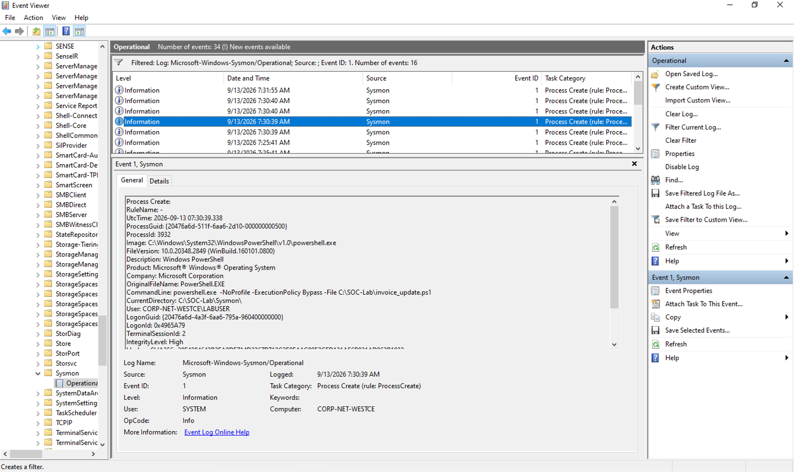
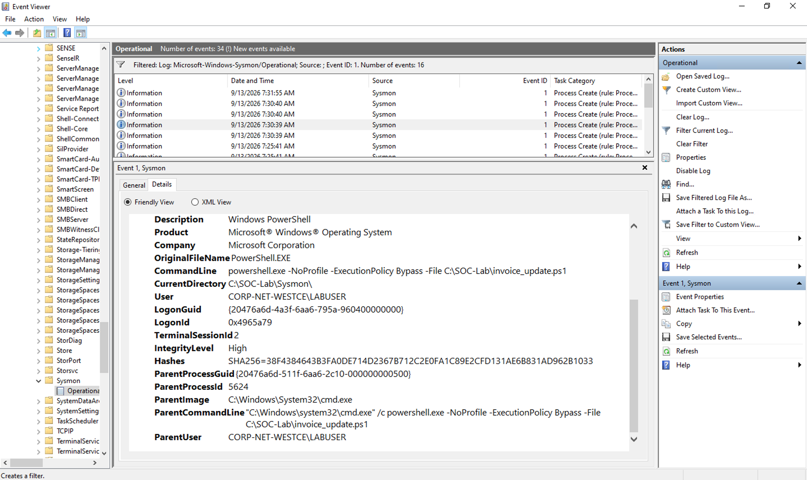
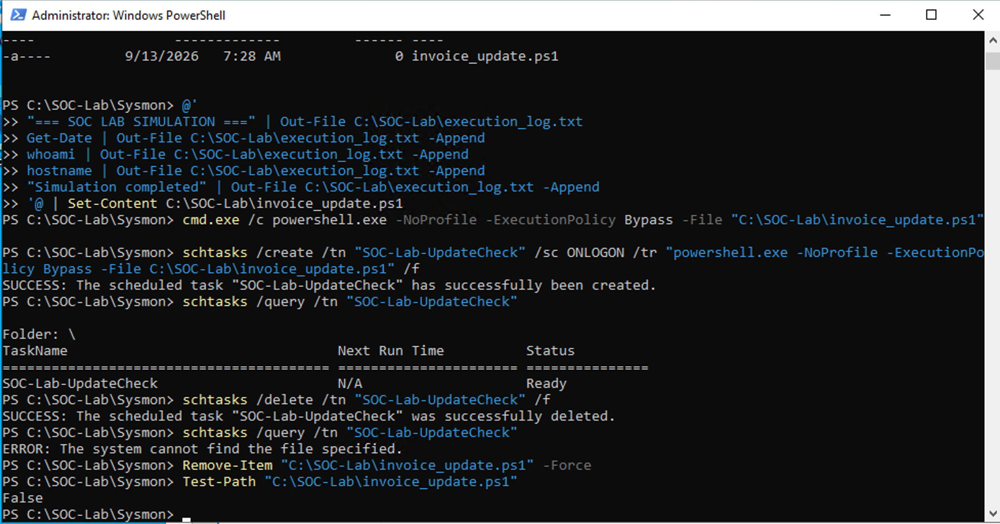
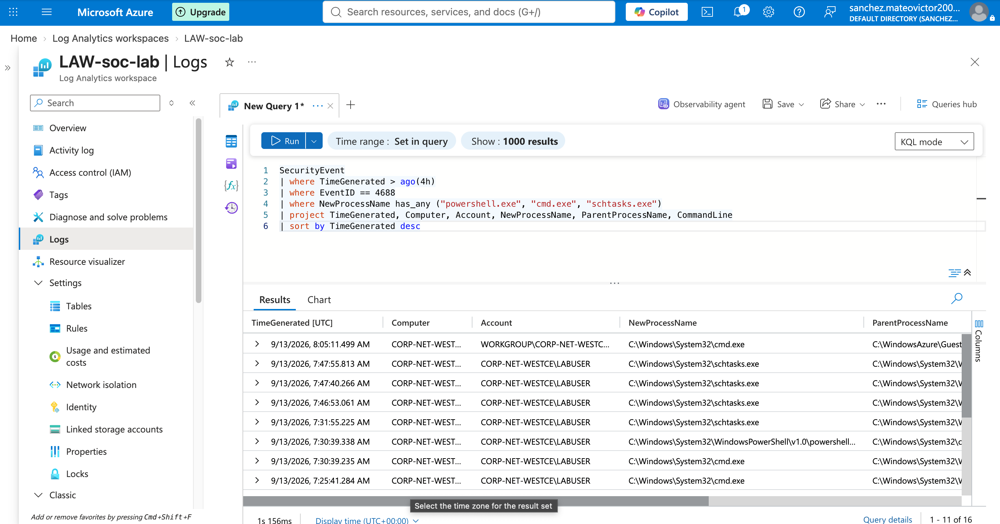
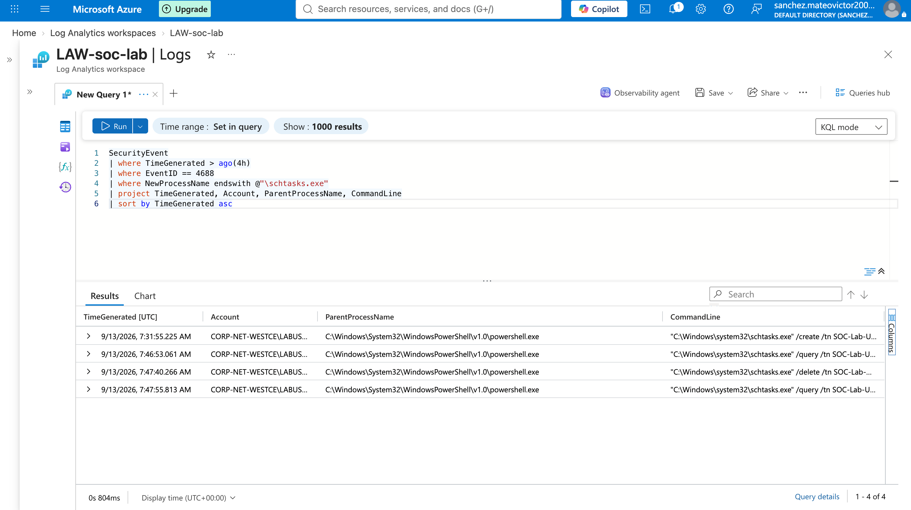
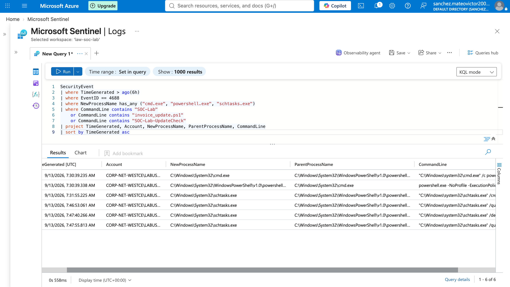

# Endpoint Detection Investigation Lab
SOC endpoint investigation lab using Sysmon, Windows Event Logs, Microsoft Sentinel, and KQL to detect suspicious PowerShell execution, trace process relationships, identify scheduled task persistence, and perform containment/remediation.


## Project Overview

This project simulates an endpoint security investigation in a controlled lab environment. I generated suspicious PowerShell and scheduled task activity on a Windows endpoint, collected process telemetry with Sysmon, and investigated the activity using Microsoft Sentinel and KQL.

The investigation focused on identifying suspicious process execution, analyzing parent-child process relationships, reviewing command-line activity, and validating persistence through a scheduled task.

After confirming the simulated activity, I performed containment and remediation by removing the scheduled task and associated PowerShell script.

## Lab Environment

- Microsoft Azure
- Microsoft Sentinel
- Log Analytics Workspace
- Windows Virtual Machine
- Sysmon
- Windows Event Viewer
- PowerShell
- Kusto Query Language (KQL)

## Attack Simulation

To generate realistic endpoint telemetry, I created a controlled PowerShell simulation on the Windows virtual machine.

The simulation included:

- Execution of a PowerShell script named `invoice_update.ps1`
- PowerShell launched from `cmd.exe`
- Use of the `-ExecutionPolicy Bypass` parameter
- Creation of a scheduled task named `SOC-Lab-UpdateCheck`
- Querying the scheduled task to verify persistence
- Removal of the scheduled task and simulated script during remediation

All activity was performed inside my isolated lab environment for defensive security training. No production systems or external users were targeted.

## Detection and Investigation

Sysmon captured process creation events generated during the simulation. I reviewed the events in Windows Event Viewer and then used Microsoft Sentinel and KQL to investigate the activity centrally.

The investigation focused on:

- Process creation telemetry
- PowerShell execution
- Parent-child process relationships
- Command-line arguments
- Scheduled task activity
- Indicators associated with the simulated script

This allowed me to reconstruct the process chain and distinguish the intentionally suspicious activity from normal endpoint activity.

## KQL Detection Queries

### Hunt for Suspicious PowerShell Execution

```kql
SecurityEvent
| where TimeGenerated > ago(6h)
| where EventID == 4688
| where NewProcessName endswith @"\powershell.exe"
| where CommandLine contains "invoice_update.ps1"
    or CommandLine contains "ExecutionPolicy Bypass"
| project TimeGenerated, Computer, Account, NewProcessName, ParentProcessName, CommandLine
| sort by TimeGenerated asc
```

This query isolates the simulated PowerShell execution and allows an analyst to review the account, parent process, and command-line arguments associated with the activity.

### Hunt for Scheduled Task Activity

```kql
SecurityEvent
| where TimeGenerated > ago(6h)
| where EventID == 4688
| where NewProcessName endswith @"\schtasks.exe"
| project TimeGenerated, Computer, Account, NewProcessName, ParentProcessName, CommandLine
| sort by TimeGenerated asc
```

This query identifies the schtasks.exe activity used to create, query, and remove the SOC-Lab-UpdateCheck scheduled task.

### Reconstruct the Suspicious Process Activity

```kql
SecurityEvent
| where TimeGenerated > ago(6h)
| where EventID == 4688
| where NewProcessName has_any ("cmd.exe", "powershell.exe", "schtasks.exe")
| where CommandLine contains "SOC-Lab"
    or CommandLine contains "invoice_update.ps1"
    or CommandLine contains "SOC-Lab-UpdateCheck"
| project TimeGenerated, Account, NewProcessName, ParentProcessName, CommandLine
| sort by TimeGenerated asc
```

The combined query was used to reconstruct the sequence of activity and correlate the PowerShell execution with the scheduled-task persistence behavior.

## Investigation Findings

The investigation identified a suspicious process chain involving Windows Command Processor, PowerShell, and Task Scheduler.

Key findings included:

- `cmd.exe` launched `powershell.exe`
- PowerShell executed with `-NoProfile` and `-ExecutionPolicy Bypass`
- The script `C:\SOC-Lab\invoice_update.ps1` was executed
- A scheduled task named `SOC-Lab-UpdateCheck` was created
- The scheduled task was configured to run at user logon
- `schtasks.exe` activity showed task creation, verification, deletion, and post-remediation verification
- Sysmon Event ID 1 and Windows Security Event ID 4688 were used to reconstruct the activity
- Parent-child process relationships confirmed the execution sequence

### Process Chain

```text
cmd.exe
  └── powershell.exe
      └── invoice_update.ps1

schtasks.exe
  └── SOC-Lab-UpdateCheck
```

The activity was intentionally generated in a controlled lab, but the telemetry resembles behavior that could require investigation in a production SOC environment.

## Containment and Remediation

After identifying the persistence mechanism, I removed the scheduled task and deleted the simulated PowerShell script.
The following actions were performed:

- Deleted SOC-Lab-UpdateCheck
- Queried the scheduled task again to confirm it no longer existed
- Removed C:\SOC-Lab\invoice_update.ps1
- Used Test-Path to verify that the script had been removed successfully

The final verification returned False, confirming that the simulated script was no longer present on the endpoint.

## MITRE ATT&CK Mapping

The simulated activity mapped to the following MITRE ATT&CK techniques:

- **T1059.001 – Command and Scripting Interpreter: PowerShell**
  - PowerShell was used to execute the simulated `invoice_update.ps1` script.

- **T1059.003 – Command and Scripting Interpreter: Windows Command Shell**
  - `cmd.exe` was used to launch PowerShell during the execution chain.

- **T1053.005 – Scheduled Task/Job: Scheduled Task**
  - A scheduled task named `SOC-Lab-UpdateCheck` was created to simulate persistence at user logon.

## Analyst Conclusion

The investigation identified a suspicious process chain in which `cmd.exe` launched PowerShell with `-ExecutionPolicy Bypass` to execute `invoice_update.ps1`.

Further analysis identified scheduled task activity associated with `SOC-Lab-UpdateCheck`, confirming a persistence mechanism within the simulated environment.

The activity was correlated using Sysmon telemetry, Windows Security Event ID 4688, and KQL in Microsoft Sentinel.

Containment and remediation were successfully completed by removing the scheduled task and deleting the associated PowerShell script. Follow-up verification confirmed that the persistence mechanism and script were no longer present.

This lab demonstrates practical experience with:

- Endpoint telemetry analysis
- Process tree investigation
- PowerShell detection
- Scheduled task persistence analysis
- KQL threat hunting
- MITRE ATT&CK mapping
- Containment and remediation

## Evidence and Screenshots

The following screenshots document the investigation from initial execution through remediation.

### 1. PowerShell Execution

This screenshot shows Sysmon Event ID 1 capturing the execution of `powershell.exe` with the `-ExecutionPolicy Bypass` parameter and the `invoice_update.ps1` script.



### 2. Parent-Child Process Relationship

This screenshot shows the process relationship between `cmd.exe` and `powershell.exe`, helping reconstruct how the suspicious activity was launched.



### 3. Containment and Remediation

This screenshot shows the scheduled task being deleted and the simulated script being removed from the endpoint.



### 4. KQL Process Hunt

This screenshot shows Microsoft Sentinel querying Windows Security Event ID 4688 for `cmd.exe`, `powershell.exe`, and `schtasks.exe` activity.



### 5. Scheduled Task Investigation

This screenshot shows KQL results for `schtasks.exe`, including creation, verification, and deletion of the `SOC-Lab-UpdateCheck` scheduled task.



### 6. Final Investigation Timeline

This screenshot shows the correlated timeline of the simulated activity, allowing the sequence of PowerShell, command shell, and scheduled-task activity to be reviewed chronologically.




## Skills Demonstrated

- Microsoft Sentinel investigation
- KQL threat hunting
- Windows Security Event analysis
- Sysmon Event ID 1 analysis
- Parent-child process investigation
- Suspicious PowerShell detection
- Scheduled task persistence analysis
- Command-line analysis
- MITRE ATT&CK mapping
- Containment and remediation
- Incident timeline reconstruction

## Disclaimer

This project was performed in a controlled lab environment for cybersecurity training and portfolio development. All suspicious activity was intentionally simulated against systems I controlled. No production systems, external organizations, or real users were targeted.
